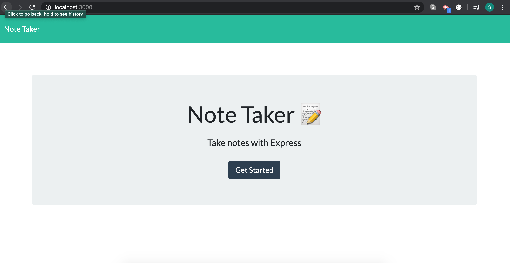

## Note Taker

The purpose of this app is to allow users to take notes and save them or delete them. The app is hosted on localhost. On the backend, there are two html routes: '/' routes the user to index.html and '/notes' routes the user to notes.html. Additionally, there are three API routes: a '/api/notes' get request on the client side will return the array of notes back to the client in json format, a '/api/notes/' post request will add the new note (req.body) to the notes array and return the new note in json format to the client, a '/api/notes/:id' delete request will splice the note with that specific id out of the array and return the new array of notes to the user in json format.

#### How to use

npm install express --save

#### 

